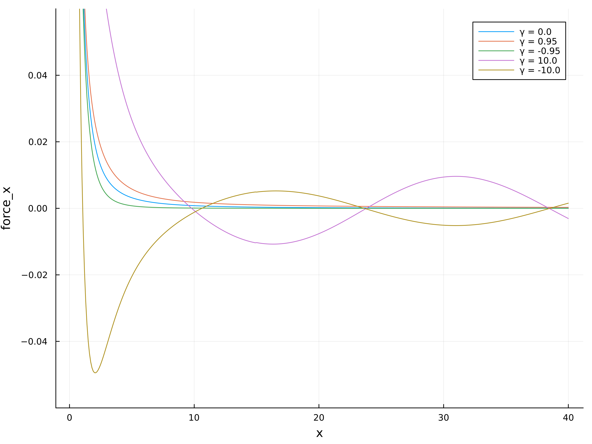

# QuasiEwald.jl

[](https://github.com/ArrogantGao/QuasiEwald.jl/actions/workflows/CI.yml?query=branch%3Amain)

`QuasiEwald.jl` is a package written in `Julia`. 
It is an implementation of the algorithm Quasi Ewald Method, which used to calculate the electrostatic interaction in dielectric confined Quasi-2D charged systems for MD simulations, which has a linear complexity to the number of particles.

## Getting Started

This package has to be used as an extentation of the author's previous package [`ExTinyMD.jl`](https://github.com/ArrogantGao/ExTinyMD.jl), which is a small but fast MD package written in `Julia` language.
To use this package, you only need to type
```julia
pkg> add ExTinyMD, QuasiEwald
```
in your command lines.

Here is an simple example, which will calculate the interaction between two paricle confined by dielectric substrate of different dielectric permittivity.
```julia
using Plots, ExTinyMD, QuasiEwald

begin
    n_atoms = 2
    L = 180.0
    boundary = ExTinyMD.Q2dBoundary(L, L, 10.0)

    atoms = Vector{Atom{Float64}}()
    for i in 1:n_atoms
        push!(atoms, Atom(mass = 1.0, charge = (-1.0)^i))
    end

    info = SimulationInfo(n_atoms, atoms, (0.0, L, 0.0, L, 0.0, 10.0), boundary; min_r = 1.0, temp = 1.0)

    Force_x = Vector{Vector{Float64}}()
    coord_1 = Point(50.0, 50.0, 1.0)
    X = 0.1:0.1:40.0

    for (γ_1, γ_2) in [(0.0, 0.0), (0.95, 0.95), (-0.95, -0.95), (10.0, 10.0), (-10.0, -10.0)]
        ϵ_0 = 1.0
        n_t = 30

        N_real = 100
        N_img = 20
        ICM_sys = IcmSys((γ_2, γ_1), (L, L, 10.0), N_real, N_img)
        ref_pos, ref_charge = IcmSysInit(ICM_sys, info.coords, [atom.charge for atom in atoms])
        force_icm = IcmForce(ICM_sys, info.coords, [atom.charge for atom in atoms], ref_pos, ref_charge) ./ ϵ_0;

        accuracy = 1e-4
        α = 1.0
        r_c = 15.0
        k_c = sqrt(-4 * α * log(accuracy))

        force_x = Vector{Float64}()

        for x_2 in X
            coord_2 = Point(50.0 + x_2, 50.0, 1.01)
            info.coords = [coord_1, coord_2]
            sortz = SortingFinder(info.coords)
            cellq2d = CellListDirQ2D(info, r_c, boundary, 1)
            interaction_short = QuasiEwaldShortInteraction(γ_1, γ_2, ϵ_0, (L, L, 10.0), false, accuracy, α, n_atoms, r_c, n_t)
            interaction_long = QuasiEwaldLongInteraction(γ_1, γ_2, ϵ_0, (L, L, 10.0), false, accuracy, α, n_atoms, k_c, 0)
    
            force_qem = [Point(0.0, 0.0, 0.0) for i in 1:n_atoms]
            QuasiEwald_Fs!(interaction_short, cellq2d, atoms, boundary, info.coords, force_qem)
            QuasiEwald_Fl!(interaction_long, sortz, atoms, boundary, info.coords, force_qem)    
            push!(force_x, force_qem[1][1])
        end
        push!(Force_x, force_x)
    end

    plot(dpi = 300, size = (800, 600), legend = :topleft, xlabel = "x", ylabel = "force_x")
    for (γ, force_x) in zip([0.0, 0.95, -0.95, 10.0, -10.0], Force_x)
        plot!(X, force_x, label = "γ = " * string(γ), ylim = [-0.06, 0.06])
    end
    savefig("force_x.png")
end
```
To run this script, you can simple type:
```
julia ./example/force/force_pair.jl
```
The result is shown below:




Here is another example, which shows how to simulate a dielectric confined charged system via `ExTinyMD.jl` and `QuasiEwald.jl`.
```julia
using ExTinyMD, QuasiEwald

begin
    n_atoms = 436
    n_atoms = Int64(round(n_atoms))
    L_x = 100.0
    L_y = 100.0
    L_z = 50.0
    L = (L_x, L_y, L_z)
    boundary = Q2dBoundary(L_x, L_y, L_z)
    atoms = Vector{Atom{Float64}}()

    for i in 1:218
        push!(atoms, Atom(mass = 1.0, charge = 1.0))
    end

    for i in 219:436
        push!(atoms, Atom(mass = 1.0, charge = - 1.0))
    end

    (γ_1, γ_2) = (0.95, -0.95)

    info = SimulationInfo(n_atoms, atoms, (0.0, L_x, 0.0, L_y, 0.5, L_z - 0.5), boundary; min_r = 2.0, temp = 1.0)
    coords = info.coords;
    z_coords = [coord[3] for coord in coords];
    z_list = sortperm(z_coords);

    ϵ_0 = 1.0

    accuracy = 1e-4
    α = 1.0
    k_c = sqrt(- 4 * α * log(accuracy))
    r_c = (α * accuracy)^(-1/3) / 2
    n_t = 30
    rbe_p = 50

    intershort = QuasiEwaldShortInteraction(γ_1, γ_2, ϵ_0, L, true, accuracy, α, n_atoms, r_c, n_t)
    short_finder = CellListDirQ2D(info, r_c + 1.0, boundary, 100)
    interlong = QuasiEwaldLongInteraction(γ_1, γ_2, ϵ_0, L, true, accuracy, α, n_atoms, k_c, rbe_p)
    long_finder = SortingFinder(coords)

    interactions = [
        (LennardJones(), CellListDir3D(info, 4.5, boundary, 100)),
        (SubLennardJones(0.0, L_z; cutoff = 0.5, σ = 0.5), SubNeighborFinder(1.0, info.coords, 0.0, L_z)), 
        (intershort, short_finder),
        (interlong, long_finder)
        ]

    loggers = [TempartureLogger(100, output = true), TrajectionLogger(info, 100, output = true)]
    simulator = VerletProcess(dt = 0.001, thermostat = AndersenThermoStat(1.0, 0.05))

    sys = MDSys(
        n_atoms = n_atoms,
        atoms = atoms,
        boundary = boundary,
        interactions = interactions,
        loggers = loggers,
        simulator = simulator
    )
    
    simulate!(simulator, sys, info, 1000000)
end
```
which will simulate 436 changed particle confined by substrates with $\gamma = 0.95$ for $10^6$ steps, and the trajection will be recorded.

## Questions and Contributions

Please open an [issue](https://github.com/ArrogantGao/QuasiEwald.jl/issues)
if you encounter any problems, or have any feature requests.

It is also welcomed for any suggestions about the issues marked as `enhancement`, please let us know if you have any idea about them.