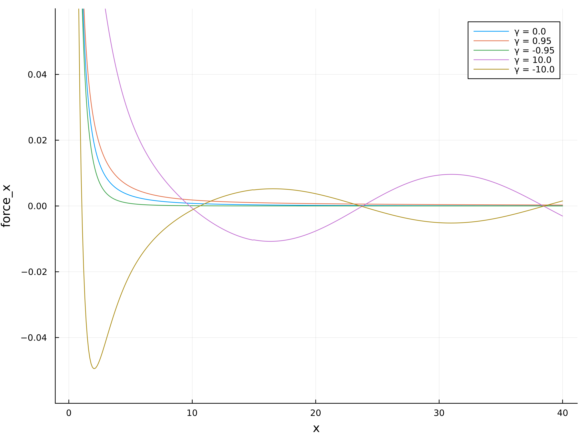

# QuasiEwald.jl

[](https://github.com/ArrogantGao/QuasiEwald.jl/actions/workflows/CI.yml?query=branch%3Amain)

`QuasiEwald.jl` is a package written in `Julia`. 
It is an implementation of the algorithm Quasi Ewald Method, which used to calculate the electrostatic interaction in dielectric confined Quasi-2D charged systems for MD simulations, which has a linear complexity to the number of particles.

## Getting Started

`QuasiEwald.jl`'s core has **no dependency on ExTinyMD**: it takes plain
array-of-structs positions, a charge vector, and its own parameters, and
returns an energy or a force. `ExTinyMD` is only a *weak* dependency, used
solely to drive `simulate!`; it is loaded automatically (no configuration
needed) whenever you also `using ExTinyMD` in the same session, and its
absence in `[deps]` is why this package no longer requires it just to
compute an energy.

```julia
pkg> add QuasiEwald
```

is enough for standalone use. Add `ExTinyMD` too if you want to drive an MD
loop (see [MD usage via ExTinyMD](#md-usage-via-extinymd) below).

### Standalone usage (no ExTinyMD)

The core API is a **plan** (pure parameters plus solver scratch, no
ExTinyMD type anywhere) queried against plain arrays:

```julia
using QuasiEwald, StaticArrays

n = 100
L = (100.0, 100.0, 10.0)     # (Lx, Ly, Lz); z is the non-periodic, confined axis
poses = [SVector(L[1]*rand(), L[2]*rand(), 1.0 + 8.0*rand()) for _ in 1:n]
charges = [isodd(i) ? 1.0 : -1.0 for i in 1:n]

γ_1, γ_2 = 0.4, -0.5          # dielectric mismatch at the z = 0 / z = Lz boundaries
ϵ_0 = 1.0
accuracy = 1e-4
α = 1.0
r_c = 4.5                    # r_c must be < min(Lx, Ly) / 2 = 50.0 here
k_c = sqrt(-4 * α * log(accuracy))
n_t = 30

short_plan = QuasiEwaldShortPlan(γ_1, γ_2, ϵ_0, L, false, accuracy, α, n, r_c, n_t)
long_plan  = QuasiEwaldLongPlan(γ_1, γ_2, ϵ_0, L, false, accuracy, α, n, k_c, 0)

E = QuasiEwald.energy(short_plan, poses, charges) + QuasiEwald.energy(long_plan, poses, charges)
F = QuasiEwald.force(short_plan, poses, charges) .+ QuasiEwald.force(long_plan, poses, charges)
```

A few things worth knowing:

- **`poses` may be `Vector{SVector{3,T}}`, `Vector{NTuple{3,T}}`, or ExTinyMD's `Vector{Point{3,T}}`** --
  the kernels only ever index `p[1]`/`p[2]`/`p[3]`, never rely on
  vector-vector arithmetic on the elements you pass in, so no conversion
  layer is needed either way. `SVector{3,T}` is the canonical/recommended
  choice.
- **`QuasiEwald.energy`, `QuasiEwald.force` and `QuasiEwald.force!` are
  defined but deliberately not exported** -- always call them qualified.
  (If every electrostatics package in this family exported its own
  `energy`, `using QuasiEwald, SoEwald2D` would make the bare name
  ambiguous.) The plan **constructors** (`QuasiEwaldShortPlan`,
  `QuasiEwaldLongPlan`, `ZSorter`, and the ICM helpers `IcmSys`/
  `IcmSysInit`/`IcmEnergy`/`IcmForce`) are exported as usual.
- **`r_c` must be strictly less than `min(Lx, Ly) / 2`.** The geometry is
  quasi-2D: `x`/`y` are periodic, `z` is not (it is the confined,
  dielectric-bounded axis). The short-range cutoff only ever needs to see
  at most one periodic image per axis; anything ≥ half the box breaks that
  and is not supported.
- Neither `poses` nor `charges` is ever mutated by a query.
- `QuasiEwaldShortPlan.energy`/`force`/`force!` accept an optional
  `neighbor_list =` keyword (candidate `(i, j, ...)` pairs -- e.g. a
  `CellListMap` neighbor list you already maintain); the true in-plane
  distance is always recomputed from `poses`, so a supplied list's own
  reported distance is ignored. With none given, every pair is tested
  directly (`O(n_atoms^2)`) -- this plan does not own a persistent cell
  list of its own. `QuasiEwaldLongPlan.energy`/`force`/`force!` similarly
  accept `z_list =` (a z-sort you already have, e.g. from a
  [`ZSorter`](@ref) you keep across calls) and otherwise sort fresh with
  `sortperm` each call.

### MD usage via ExTinyMD

Placing quasi-2D electrostatics in `sys.interactions` (so `simulate!`
drives it) needs `ExTinyMD.AbstractInteraction`/`AbstractNeighborFinder`
wrapper types, which can only be *defined* once ExTinyMD exists -- they
live in this package's `ExTinyMD` extension (`ext/QuasiEwaldExTinyMDExt.jl`),
loaded automatically the moment both packages are `using`'d together.
`QuasiEwaldShortInteraction`, `QuasiEwaldLongInteraction` and
`SortingFinder` are constructed exactly as before this package was
decoupled from ExTinyMD -- the wrapper just holds a
`QuasiEwaldShortPlan`/`QuasiEwaldLongPlan`/`ZSorter` internally now:

```julia
using ExTinyMD, QuasiEwald

intershort = QuasiEwaldShortInteraction(γ_1, γ_2, ϵ_0, L, true, accuracy, α, n_atoms, r_c, n_t)
short_finder = CellListQ2D(info, r_c + 1.0, boundary, 100)
interlong = QuasiEwaldLongInteraction(γ_1, γ_2, ϵ_0, L, true, accuracy, α, n_atoms, k_c, rbe_p)
long_finder = SortingFinder(info)

sys = MDSys(
    n_atoms = n_atoms, atoms = atoms, boundary = boundary,
    interactions = [(intershort, short_finder), (interlong, long_finder)],
    loggers = loggers, simulator = simulator,
)
simulate!(simulator, sys, info, n_steps)
```

Calling `QuasiEwaldShortInteraction`/`QuasiEwaldLongInteraction`/
`SortingFinder` before `using ExTinyMD` raises a clear error naming the
extension, rather than an `UndefVarError`.

### A note for anyone pinning this package against a sibling ExTinyMD checkout

This package's `Project.toml` currently carries a `[sources]` override
pinning `ExTinyMD` to its GitHub `main` branch, because ExTinyMD 0.3 (the
version this package requires) is not yet on the General registry (only
0.2.7 is). That override is temporary and tracked centrally across every
downstream package in
[`ExTinyMD.jl`'s downstream-decoupling design doc, §6b](https://github.com/HPMolSim/ExTinyMD.jl/blob/main/docs/superpowers/specs/2026-09-15-downstream-decoupling-design.md);
General's automerge refuses any package whose `Project.toml` contains
`[sources]`, so this package cannot be tagged/registered until ExTinyMD 0.3
is registered and this override is removed.

Here is an simple example, which will calculate the interaction between two paricle confined by dielectric substrate of different dielectric permittivity.
```julia
using Plots, ExTinyMD, QuasiEwald

begin
    n_atoms = 2
    L = 180.0
    boundary = ExTinyMD.Q2dBoundary(L, L, 10.0) 

    atoms = [Atom(type = 1, mass = 1.0, charge = 1.0), Atom(type = 2, mass = 1.0, charge = -1.0)]

    sys = MDSys(
                n_atoms = n_atoms,
                atoms = atoms,
                boundary = boundary,
                interactions = [(NoInteraction(), NoNeighborFinder(n_atoms))],
                loggers = [TrajectionLogger(step = 100, output = false)],
                simulator = VerletProcess(dt = 0.001, thermostat = AndersenThermoStat(1.0, 0.05))
            )

    Force_x = Vector{Vector{Float64}}()
    coord_1 = Point(50.0, 50.0, 1.0)
    X = 0.1:0.1:40.0

    for (γ_1, γ_2) in [(0.0, 0.0), (0.95, 0.95), (-0.95, -0.95), (10.0, 10.0), (-10.0, -10.0)]
        ϵ_0 = 1.0
        n_t = 30

        accuracy = 1e-4
        α = 1.0
        r_c = 15.0
        k_c = sqrt(-4 * α * log(accuracy))

        force_x = Vector{Float64}()

        for x_2 in X
            info = SimulationInfo(n_atoms, atoms, (0.0, L, 0.0, L, 0.0, 10.0), boundary; min_r = 1.0, temp = 1.0)
            coord_2 = Point(50.0 + x_2, 50.0, 1.01)

            info.particle_info[1].position = coord_1
            info.particle_info[2].position = coord_2

            sortz = SortingFinder(info)
            cellq2d = CellListQ2D(info, r_c, boundary, 1)
            interaction_short = QuasiEwaldShortInteraction(γ_1, γ_2, ϵ_0, (L, L, 10.0), false, accuracy, α, n_atoms, r_c, n_t)
            interaction_long = QuasiEwaldLongInteraction(γ_1, γ_2, ϵ_0, (L, L, 10.0), false, accuracy, α, n_atoms, k_c, 0)
    
            info.particle_info[1].acceleration = Point(0.0, 0.0, 0.0)
            info.particle_info[2].acceleration = Point(0.0, 0.0, 0.0)
            ExTinyMD.update_acceleration!(interaction_short, cellq2d, sys, info)
            ExTinyMD.update_acceleration!(interaction_long, sortz, sys, info)
            push!(force_x, info.particle_info[1].acceleration[1])
        end
        push!(Force_x, force_x)
    end

    plot(dpi = 300, size = (800, 600), legend = :topright, xlabel = "x", ylabel = "force_x")
    for (γ, force_x) in zip([0.0, 0.95, -0.95, 10.0, -10.0], Force_x)
        plot!(X, force_x, label = "γ = " * string(γ), ylim = [-0.06, 0.06])
    end
    savefig("force_x.png")
end
```
To run this script, you can simple type:
```
julia ./example/force/force_pair.jl
```
The result is shown below:




Here is another example, which shows how to simulate a dielectric confined charged system via `ExTinyMD.jl` and `QuasiEwald.jl`.
```julia
using ExTinyMD, QuasiEwald

begin
    n_atoms = 436
    n_atoms = Int64(round(n_atoms))
    L_x = 100.0
    L_y = 100.0
    L_z = 50.0
    L = (L_x, L_y, L_z)
    boundary = Q2dBoundary(L_x, L_y, L_z)
    atoms = Vector{Atom{Float64}}()

    for i in 1:218
        push!(atoms, Atom(type = 1, mass = 1.0, charge = 1.0))
    end

    for i in 219:436
        push!(atoms, Atom(type = 2, mass = 1.0, charge = - 1.0))
    end

    (γ_1, γ_2) = (0.95, -0.95)

    info = SimulationInfo(n_atoms, atoms, (0.0, L_x, 0.0, L_y, 0.5, L_z - 0.5), boundary; min_r = 2.0, temp = 1.0)

    ϵ_0 = 1.0

    accuracy = 1e-4
    α = 1.0
    k_c = sqrt(- 4 * α * log(accuracy))
    r_c = (α * accuracy)^(-1/3) / 2
    n_t = 30
    rbe_p = 50

    intershort = QuasiEwaldShortInteraction(γ_1, γ_2, ϵ_0, L, true, accuracy, α, n_atoms, r_c, n_t)
    short_finder = CellListQ2D(info, r_c + 1.0, boundary, 100)
    interlong = QuasiEwaldLongInteraction(γ_1, γ_2, ϵ_0, L, true, accuracy, α, n_atoms, k_c, rbe_p)
    long_finder = SortingFinder(info)

    interactions = [
        (LennardJones(), CellList3D(info, 4.5, boundary, 100)),
        (SubLennardJones(0.0, L_z; cutoff = 0.5, σ = 0.5), SubNeighborFinder(1.0, info, 0.0, L_z)), 
        (intershort, short_finder),
        (interlong, long_finder)
        ]

    loggers = [TempartureLogger(100, output = true), TrajectionLogger(step = 100, output = true)]
    simulator = VerletProcess(dt = 0.001, thermostat = AndersenThermoStat(1.0, 0.05))

    sys = MDSys(
        n_atoms = n_atoms,
        atoms = atoms,
        boundary = boundary,
        interactions = interactions,
        loggers = loggers,
        simulator = simulator
    )

    simulate!(simulator, sys, info, 100000)
end
```
which will simulate 436 changed particle confined by substrates with $\gamma = 0.95$ for $10^6$ steps, and the trajection will be recorded.

## Questions and Contributions

Please open an [issue](https://github.com/ArrogantGao/QuasiEwald.jl/issues)
if you encounter any problems, or have any feature requests.

It is also welcomed for any suggestions about the issues marked as `enhancement`, please let us know if you have any idea about them.